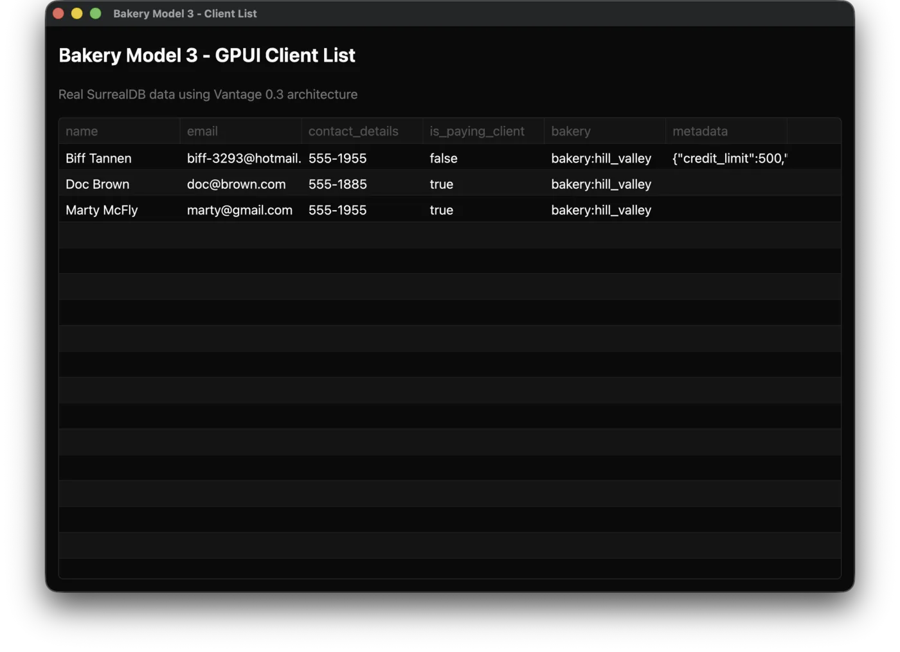
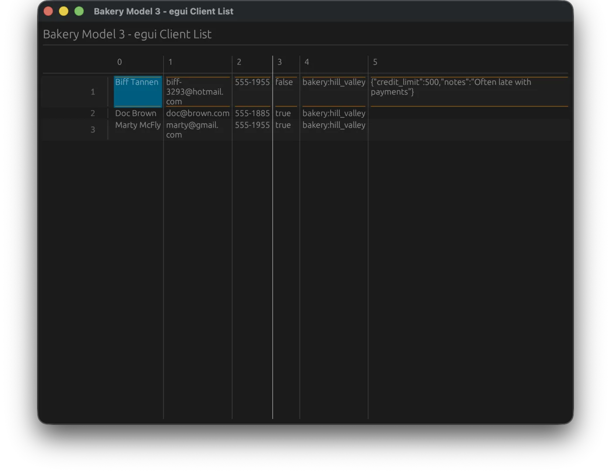
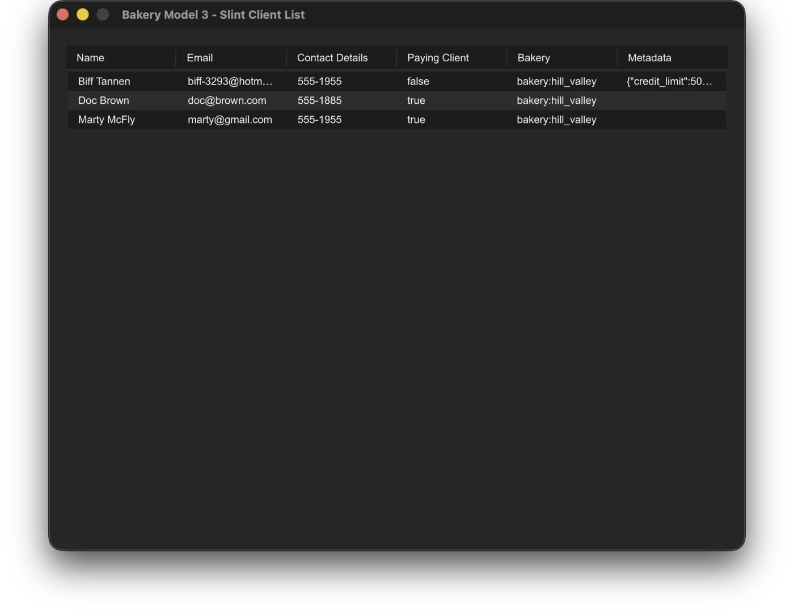
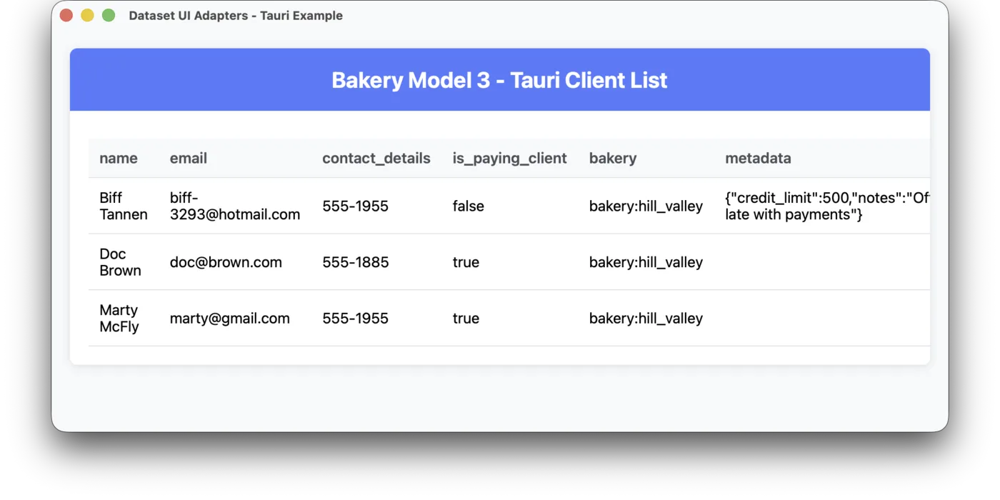
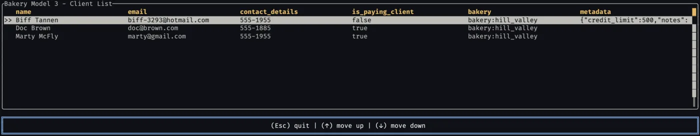
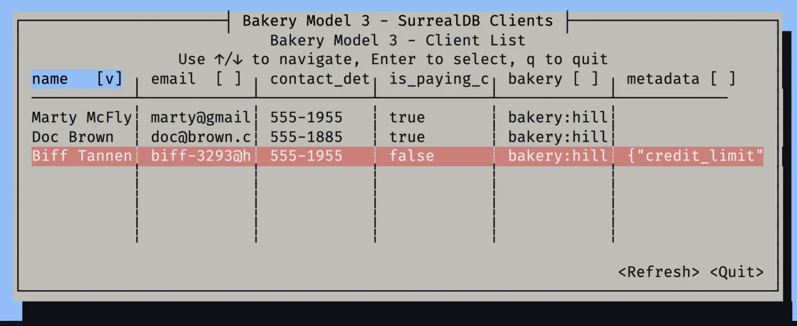
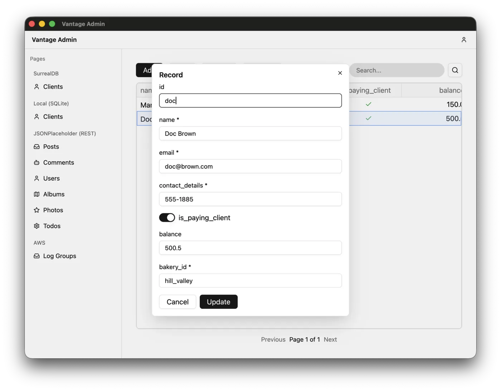

+++
title = "A problem Vantage UI is solving"
description = "A year ago, Vantage UI didn't exist at all. Our effort went into a Rust framework for managing business entities efficiently, one that any engineering team could use. Then the rise of AI revealed a gap, and an opportunity."
date = 2026-10-04

[extra]
unlisted = true
cover = "cover.jpg"
show_cover = false
+++


<figure><figcaption>Your bakery clients in a generic <b>GPUI</b> table, drawn on the GPU like the Zed editor</figcaption></figure>

<figure><figcaption>Your bakery clients in a generic <b>egui</b> table, repainted from scratch every frame</figcaption></figure>

<figure><figcaption>Your bakery clients in a generic <b>Slint</b> table, laid out in its own markup</figcaption></figure>

<figure><figcaption>Your bakery clients in a generic <b>Tauri</b> table, a web page in a small desktop app</figcaption></figure>

<figure><figcaption>Your bakery clients in a generic <b>ratatui</b> table, in a terminal</figcaption></figure>

<figure><figcaption>Your bakery clients in a generic <b>Cursive</b> table, in a terminal with windows of its own</figcaption></figure>


## Thirty-five years of programming, then one of writing code with AI


One of the first principles of programming is to spend a little more time up front finding systematic practices, so that the rest of the code comes out consistent, compact and predictable.


AI-generated code doesn't follow this principle, and I think there are two reasons. First, an LLM doesn't see the big picture and doesn't future-proof your app. Second, it's not really in the LLM provider's interest to save you effort, or tokens, in the long run.

Programmers' collective push for efficiency gave us CSS frameworks, MVC frameworks and API standards. How many standards or frameworks has your LLM introduced on its own initiative? It has never happened to me. On the contrary, my codebases end up with four or five parallel implementations of the same mechanism.

What drives me in Vantage is teaching coding agents to follow patterns. My [previous post](@/blog/vantage-1-0/index.md) explained how the Vantage framework builds patterns for data sources, business entities and working with data. A unified standard in the data abstraction layer opens a window for generic UI systems, literally. Vantage UI is that window.

If you are building a critical business application, just like me, you would want to feel in control, a feeling LLMs often deprive us of. You want to be sure the underlying implementation is efficient and accountable. While apps like Zed and Cursor race to build new ways to control agents, Vantage UI is a way to see what they've built before it becomes a cog in your enterprise machinery.

## Why is generic UI important?

When Claude 4 came out, I decided to rewrite my admin system in React. The first screen was great, and the UI was stunning. I asked to add search and sort, and it looked lovely. But gradually the admin panel became slower. Introducing pagination was a major refactor, search conflicted with sort, and I had to go through those major rewrites on every page.

Somehow I was spending 90% of my time on technical bugs. I would have been better off with a generic CRUD solution, but the ones my agent could find were commercial products, too heavy for a minor use case like mine.

**In retrospect**, I realise that my admin implementation had to be defined by three things:

- the shape of my data, informing columns, labels and formatting options;
- the capabilities of my backend or API, enabling features like search, ordering or pagination;
- theme, placement and tweaks, based on situational requirements.

My failed admin shuffled all my requirements into the third category. Claude was never brave enough to speak up or suggest changing the API or the data model.

A generic and feature-rich CRUD solution would have saved me weeks!

## Vantage UI 0.4: the first UI CRUD

CRUD stands for create, read, update and delete, the four main operations you would do with your generic data records. A  in Vantage carries meta-information about columns, types and capabilities, and can retrieve data, so our first prototype of Vantage UI was capable of doing all four (regardless of whether the backend was SurrealDB, SQLite or an API).

We focused the first builds on converging the diverse types used in various backends into a standard set of UI elements, such as presenting boolean values with a flip switch.

The whole  machinery didn't exist yet, and as a result the UI was laggy: a beach ball while a record was loading or paginating was a common thing.


Unresponsive web apps are everywhere. Users know not to click links while a form is being saved, but in a desktop app this is very annoying behaviour, and I knew that the next major feature had to be detaching the backend from the main UI thread, so that's what we built next.

Apps running inside a browser have major limitations: no full multi-threading support, limited networking protocol support, no command execution. But more importantly, they need a server to run and a browser to open, and neither comes with MCP support.

LLM agents see web apps as a black box, with very little agency over them.


## Vantage UI: a real-time desktop app

Building Vantage as an AI-first low-code tool made me look at the market from a new angle. Who is Vantage UI for? An AI agent, with a human watching. So every decision we make and every feature we add has to give that agent more agency, and that human more confidence.

Given that realisation, we wrote down what we owe our users:


1. To supply you with the **skills and knowledge** of every feature and capability Vantage has.
2. To give you **easy controls** for changing things: minimum effort, maximum impact.
3. To deliver **immediate insight**, error reports and a debug console, at all times.
4. To guarantee that what you build with Vantage will be a **permanent solution**, not throwaway slop.


Between versions 0.4 and 1.0, Vantage UI saw 38 releases, each focused on strengthening those fundamentals. With them, we plan to redefine the market rules for low-code apps, with:



The skills

25

skills with 127 reference guides, bundled with the app and refreshed when Vantage is upgraded

The controls

8

fully specified YAML schemas, one for each part of an application: {{<glossary.term id="page" code={true} />}}, {{<glossary.term id="table" code={true} />}}, {{<glossary.term id="action" code={true} />}}, etc.

The insight

14

MCP tools for inspecting the app, its data structure and logs, and, with your permission, the data



Vantage UI was designed from its first alpha versions to be LLM-first, not just in name but all the way through, and as more and more features are added, that remains true.

## Pre-1.0 release history

Vantage UI delivered about two releases a week in 2026:

- **0.5**: bundles skills for agents, and an MCP endpoint with a log inspection tool.
- **0.6**: humans can sort grids by clicking a header.
- **0.7**: implements links and tabs: agents can wire dependencies between tables, and humans can navigate them by right-clicking.
- **0.8**: agents can connect GraphQL APIs, and humans see the data in grid tables.
- **0.9**: tables open a million rows without stalling. Also adds DynamoDB and REST support.
- **0.10**: agents can write actions in Rhai, and add forms, charts and dashboards in YAML.
- **0.11**: adds the `cmd` data source, for tools such as the AWS CLI, so humans can see AWS S3 objects in tables.
- **0.12**: agents can write scripts that shape SurrealDB tables.
- **0.13**: a new set of skills teaches agents about relations, scripts and UI-building practices.
- **0.14**: agents now have a terminal widget that shows interactive output from commands.
- **0.15**: adds a Secret Manager, where humans can fill in `.env` without telling the agent.
- **0.16**: humans can give agents permission to access real data over MCP to debug queries.
- **0.17**: grid auto-refresh goes to sleep if the human is no longer watching the app.
- **0.18**: form dropdowns are linked to live queries, not a stale snapshot.
- **0.19**: agents can create "summary" tabs with a custom UI hierarchy.
- **0.20**: agents can build apps with the Kubernetes API as a backend, using a real-time data source.
- **0.21**: agents can prototype on fake data, static or live, to brainstorm ideas with the human before creating a database structure.
- **0.22**: refactors into a single language for building custom page layouts, not only the summary screen.
- **0.23**: pages now `observe:` and display live data, not static snapshots.
- **0.24**: adds a Finder-like component for displaying folder-shaped data.
- **0.25**: OAuth support: SurrealDB sign-in through your own identity provider.
- **0.26**: builds a better welcome screen for humans, with example apps, if the agent is absent.
- **0.27**: table columns can show values from related records, or values computed in real time.
- **0.28**: improves the add/edit/delete controls, implementing a new page layout.
- **0.29**: implements a form kit, so agents can design custom form layouts.
- **0.30**: implements a plugin engine, and single-record pages with arguments.
- **0.31**: lets agents add `debug: true` and see every request the app makes to a data source.
- **0.32**: moves search to the data source (a `where` clause) instead of filtering what's loaded in the client, for data sources that can search.
- **0.33**: installed apps update themselves without a restart.
- **0.34**: improves credential storage and implements a browser sign-in loop.
- **0.35**: agents can now preview the exact query a table sends, without running it.
- **0.36**: new UI widgets: KPI tiles, dropdown filters and stacked charts for dashboards.
- **0.37**: implements multi-step wizards with progress, Cancel and Retry.
- **0.38**: one scripting engine everywhere, with time limits that stop runaway scripts.
- **0.39**: implements a custom grid filtering form, and adds a Markdown renderer for showing README files.
- **0.40**: improves security by running the database in containers; agents can inspect and restart it with MCP tools.
- **0.41**: a connect-your-data wizard for humans, and new skills covering 13 data sources.
- **0.42**: refactors REST and GraphQL to handle outages, so agents don't have to worry about failures, and humans see a health indicator for databases and APIs.
- **1.0**: agents can redefine the whole app layout in YAML, and edits apply at once.
- **1.1**: finishes the Rhai refactor by unifying the language everywhere.

Features keep coming every week. If you download Vantage, it will update itself.

## What's next

Release 1.0 is coming soon. With it, we plan to include a proper solution to my React problem: the same generic UI, able to run on the web. That will let us deliver on our practicality pledge, so what your agent builds with Vantage can reach your whole team, not only the people with the desktop app.
