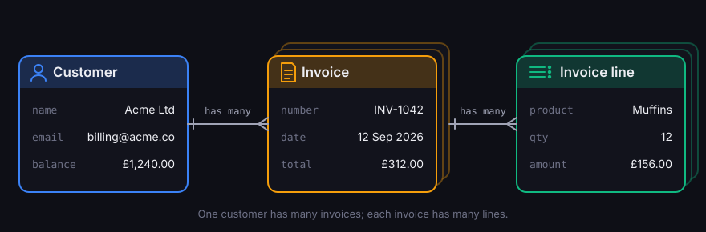

+++
title = "Getting ready to ship Vantage 1.0"
description = "Before the official release drops, let me tell you what we have shipped over the 39 previous releases this year."
date = 2026-09-27

[taxonomies]
categories = ["Releases"]

[extra]
featured = true
cover = "cover.svg"
hero = "layers.svg"
hero_alt = "A thick base of Vantage UI, free to use, and the Vantage Framework, open source. Above it, the thin layers of custom structure and custom code are the part you maintain: about twenty times less code than the same app as a React frontend and a Python backend."
+++

Vantage UI shipped its first public build, 0.4, on 9 May. The 38 releases since then have added major functionality and turned Vantage into a polished product.

In this post, I'll give a condensed recap of the features you can already find in Vantage UI.

## Vantage, the Data Framework

Vantage UI, the desktop app, would not be possible without the [Vantage framework](https://github.com/romaninsh/vantage). So let me start with what the framework brings to the table.

When we rewrote Vantage (formerly [DORM](https://medium.com/@romaninsh/building-entity-framework-in-rust-from-scratch-e6f2634fbca0)) for the third time, we made it more modular and split it into [30 crates](https://crates.io/search?q=vantage-).

Each crate is generic and additive: take what you need, and go as high up the stack as you require. Higher-level crates reuse the lower-level ones to deliver features around the entities (or models, or tables) that you define.


For simplicity's sake, let's say you are building a system that works with customers and invoices, where each invoice can consist of several itemised lines.



You might have already [vibe-coded](https://en.wikipedia.org/wiki/Vibe_coding) a short proof of concept with SQLite as the backend. Why pick Vantage?


### Persistence abstraction


Rust frameworks such as [Diesel](https://diesel.rs/) and [SeaORM](https://www.sea-ql.org/SeaORM/) offer cross-database support, but they are limited to three or four databases, typically SQL-compliant ones.

Vantage brings 15 kinds of data source: SQL, NoSQL, REST APIs, GraphQL and many others. Rather than lowering the bar to the features they all share, Vantage emphasises the unique features of each data engine.

Rust's compile-time safety lets you use advanced features against a database that supports them, and underlines incompatible ones in your Rust code. Crate: [`vantage-dataset`](https://docs.rs/vantage-dataset).


Not every data source can do the same things, so each ability is marked by a trait, and a driver implements the ones its source supports:

| Ability | The source can… | Trait | Example |
|---|---|---|---|
| Read | read records in sequence | [`ReadableValueSet`](https://docs.rs/vantage-dataset/latest/vantage_dataset/traits/trait.ReadableValueSet.html) | [CSV](https://github.com/romaninsh/vantage/tree/main/vantage-csv) |
| Write | create, update and delete by ID | [`WritableValueSet`](https://docs.rs/vantage-dataset/latest/vantage_dataset/traits/trait.WritableValueSet.html) | [ImTable](https://github.com/romaninsh/vantage/tree/main/vantage-dataset) |
| Filter | apply basic conditions | [`TableSource`](https://docs.rs/vantage-table/latest/vantage_table/traits/table_source/trait.TableSource.html) | [DynamoDB](https://github.com/romaninsh/vantage/tree/main/vantage-aws) |
| Native conditions | filter in its own syntax | [`TableSource::Condition`](https://docs.rs/vantage-table/latest/vantage_table/traits/table_source/trait.TableSource.html#associatedtype.Condition) | [MongoDB](https://github.com/romaninsh/vantage/tree/main/vantage-mongodb) |
| Query | build structured selects | [`SelectableDataSource`](https://docs.rs/vantage-expressions/latest/vantage_expressions/traits/datasource/trait.SelectableDataSource.html) | [GraphQL](https://github.com/romaninsh/vantage/tree/main/vantage-api-client) |
| Compose | use subqueries as values | [`ExprDataSource`](https://docs.rs/vantage-expressions/latest/vantage_expressions/traits/datasource/trait.ExprDataSource.html) | [PostgreSQL](https://github.com/romaninsh/vantage/tree/main/vantage-sql) |
| Extend | add non-standard syntax | [`Expressive`](https://docs.rs/vantage-expressions/latest/vantage_expressions/traits/expressive/trait.Expressive.html) | [SurrealDB](https://github.com/romaninsh/vantage/tree/main/vantage-surrealdb) |


As you port your application to Vantage and work with a specific database, its capabilities are checked at compile time. Moving to a more capable source (DynamoDB to PostgreSQL) needs no rewrite of your business code. Moving to a less capable one shows any incompatibilities as compile errors.


### Type systems


Most persistence libraries either rely on [serde](https://serde.rs/) for serialisation or leave you to handle types yourself. Both approaches struggle with custom types, including [newtypes](https://doc.rust-lang.org/rust-by-example/generics/new_types.html).

Vantage gives each data source a type system of its own, designed so that a value can't drift from one type to another. Nullable values are supported, but `Option<i64>` and `Option<String>` are deliberately kept apart.

Each persistence declares its full set of types:

- **CSV** persists every value as text, so a raw value always reads back as `String`: no hard type boundary.
- **MongoDB** has 14 BSON types, which go beyond JSON: `ObjectId`, `Decimal128`, `DateTime` and `Regex` among them.
- **SQLite** stores booleans as `0` or `1`, yet Vantage keeps `Bool` apart from `Integer`.
- **PostgreSQL** has 14 types, down to `Int2`, `Date` and `Uuid`.
- **SurrealDB** has 24, including durations, record links, ranges and eight geometry types.

What [`vantage-types`](https://docs.rs/vantage-types) delivers:

- an `Any…Type` per persistence, such as `AnyMysqlType`, that remembers which type a value holds;
- type boundaries: a value stored as a `String` won't come back as an `Email`;
- mappings between native Rust types and each `Any…Type`;
- your own types, newtypes included, can implement a database's type trait and bind as query parameters;
- `Record<AnyMysqlType>` for rows of arbitrary shape;
- `#[entity]`, which works like serde's derive but for a specific database.

Importantly, Vantage is built to work with multiple data sources side by side.




Define `Customer`, `Invoice` and `Line` as entities once, then use these types natively with the persistence. Every invoice must belong to a customer, and the table mints a time-ordered UUID for each new one as it is stored:

```rust
#[entity(SqliteType, PostgresType)]
pub struct Invoice {
    pub number: String,
    pub total: Decimal,
    pub customer_id: String,
}
```


### Queries


Vantage builds every query from `Expression`s, the building blocks of a select query. Rust's type system also allows a select query to be converted back into an `Expression` and used anywhere.

In Vantage, expressions support:

1. parameters, as typed values such as `AnySqliteType`;
2. nested expressions, each carrying its own parameters;
3. callbacks that resolve asynchronously, for example to a value fetched from another database.

Other query builders support parameters too, but in crates such as [sqlx](https://github.com/launchbadge/sqlx) they are positional values, bound one by one to a finished SQL string.

In Vantage, parameters and expressions are interchangeable:

```rust
let paid_acme_invoices = invoices
    .with_condition(invoices["customer_id"].eq(acme_id))
    .with_condition(invoices["total"].eq(invoices["paid"]));
```

Before a query is sent, Vantage flattens the nested expressions and runs the callbacks for you. Crate: [`vantage-expressions`](https://docs.rs/vantage-expressions).

Vantage supports each query language in full, extensions included, inside its persistence driver: see the complex query tests for [MySQL](https://github.com/romaninsh/vantage/blob/main/vantage-sql/tests/mysql/3_complex_queries_my.rs).


### Tables


Vantage uses `Table` rather than `Model`. A `Table<PostgresDB, Invoice>` describes a set of invoice records that live in PostgreSQL:

```rust
let invoices: Table<PostgresDB, Invoice> =
    Table::new("invoices", postgres());
```

`Table` is defined in [`vantage-table`](https://docs.rs/vantage-table). It is generic, but must be paired with a persistence, in this case `PostgresDB`.

A table typically holds [columns](https://romaninsh.github.io/vantage/intro/step2-tables.html#defining-a-table), [relations](https://romaninsh.github.io/vantage/relations.html) and [conditions](https://romaninsh.github.io/vantage/intro/step1-first-query.html#adding-conditions), but can be extended with [hooks](https://romaninsh.github.io/vantage/record-lifecycle.html#lifecycle-hooks), [sorting](https://romaninsh.github.io/vantage/intro/step4-vista.html#search-and-ordering) and [expressions](https://romaninsh.github.io/vantage/intro/step2-tables.html#computed-fields-with-expressions). A table's source can be a physical table or a [query](https://docs.rs/vantage-table/latest/vantage_table/table/base/struct.Table.html#method.from_select). A table may also have [pagination](https://romaninsh.github.io/vantage/intro/step4-vista.html#pagination), knows its [ID and title](https://romaninsh.github.io/vantage/intro/step4-vista.html#reading-schema) columns, and supports [invariants](https://romaninsh.github.io/vantage/record-lifecycle.html#set-invariants) for new records.

On top of this, a table can emit queries. [`select()`](https://docs.rs/vantage-table/latest/vantage_table/table/base/struct.Table.html#method.select) returns a query that fetches all its matching rows, in case you want to add a [join](https://docs.rs/vantage-sql/latest/vantage_sql/sqlite/statements/select/struct.SqliteSelect.html#method.with_join) or an [aggregate](https://docs.rs/vantage-expressions/latest/vantage_expressions/traits/selectable/trait.Selectable.html#method.with_group_by) before you run it. [`get_count_query()`](https://docs.rs/vantage-table/latest/vantage_table/table/base/struct.Table.html#method.get_count_query) and [`get_sum_query(col)`](https://docs.rs/vantage-table/latest/vantage_table/table/base/struct.Table.html#method.get_sum_query) return count and sum queries over the same rows.




What does that mean for your invoices? Declaring them as a `Table` gives them three layers of methods:

1. Every generic method, such as `list()`, `get(id)`, `insert()`, `get_count()` and `with_condition()`, works on invoices with no extra code.
2. Because you own `Invoice`, you can add methods of your own through an [extension trait](https://romaninsh.github.io/vantage/intro/step2-tables.html#extension-traits).
3. Drivers add their own too: SurrealDB tables, for example, gain [`SurrealTableExt`](https://docs.rs/vantage-surrealdb/latest/vantage_surrealdb/ext/trait.SurrealTableExt.html).

```rust
impl Invoice {
    pub fn table(db: PostgresDB) -> Table<PostgresDB, Invoice> {
        Table::new("invoices", db)
            .with_id_column("id")
            .with_column_of::<String>("number")
            .with_column_of::<Decimal>("total")
            .with_column_of::<Decimal>("paid")
            .with_column_of::<String>("customer_id")
            .with_one("customer", "customer_id", Customer::table)
            .with_many("lines", "invoice_id", Line::table)
            .with_expression("line_count", |t| {
                t.get_subquery_as::<Line>("lines")
                    .unwrap()
                    .get_count_query()
            })
    }
}

pub trait InvoiceTable {
    fn ref_lines(&self) -> Table<PostgresDB, Line>;
}

impl InvoiceTable for Table<PostgresDB, Invoice> {
    fn ref_lines(&self) -> Table<PostgresDB, Line> {
        self.get_ref_as("lines").unwrap()
    }
}

pub trait InvoicePdf {
    async fn convert_to_pdfs(&self) -> Result<Vec<NamedTempFile>>;
}

// Any table of invoices, whatever persistence it lives in.
impl<T> InvoicePdf for Table<T, Invoice>
where
    T: TableSource,
    Invoice: Entity<T::Value>,
{
    async fn convert_to_pdfs(&self) -> Result<Vec<NamedTempFile>> {
        let mut files = Vec::new();
        for invoice in self.list().await?.values() {
            let mut file = NamedTempFile::new()?;
            file.write_all(&render_pdf(invoice))?;
            files.push(file);
        }
        Ok(files)
    }
}
```

Because `convert_to_pdfs` is implemented for any persistence, including [`MockTableSource`](https://docs.rs/vantage-table/latest/vantage_table/mocks/mock_table_source/struct.MockTableSource.html), you can unit-test it without external dependencies:

```rust
#[tokio::test]
async fn test_pdf_render() -> Result<()> {
    let mock = MockTableSource::new()
        .with_data("invoices", sample_invoices())
        .await;
    let invoices = Table::<MockTableSource, Invoice>
        ::new("invoices", mock);

    assert_eq!(invoices.convert_to_pdfs().await?.len(), 3);
    Ok(())
}
```




### Vista and the capability check


A table is strongly typed and can be extended, but that limits where it can be used. Many UI elements need a generic abstraction that doesn't care which persistence sits behind it.

That is what [Vista](https://docs.rs/vantage-vista) is for. There are two ways to create one:

1. build a table, then wrap it in a Vista;
2. use a Vista factory to turn a [YAML/Rhai table definition](https://romaninsh.github.io/vantage/config-driven-vistas.html) into a Vista.

The first suits code you control, where the table definition is fixed at compile time. The second is what Vantage UI uses: it is a static binary, so your tables can't be compiled into it, yet it shouldn't lose anything your persistence supports.

Every Vista carries a capability check: flags such as `can_count`, `can_order`, `can_search`, `can_insert` and `can_subscribe` that say what the source behind it [supports](https://docs.rs/vantage-vista/latest/vantage_vista/capabilities/struct.VistaCapabilities.html). A generic UI widget reads them to decide what to draw: a sort header only where sorting works, a New button only where inserts work, live updates only where the source can push them.

Vista also suits a [generic command-line tool](https://github.com/romaninsh/vantage/blob/main/bakery_model3/examples/cli-vista.rs) over arbitrary data sources, or an [API endpoint](https://romaninsh.github.io/vantage/intro/step8-axum-dio.html) that serves an arbitrary set of tables.



Most of the table you wrote in Rust maps straight into a Vantage UI table file:

```yaml
# table/invoice.yaml
datasource: postgres
table: invoices
columns:
  id: { type: string, flags: [id] }   # UUID v7, minted on create
  number: { type: string, flags: [mandatory, title, searchable] }
  total: { type: int, unit: { currency: "£", minor_units: true } }
  paid: { type: int, unit: { currency: "£", minor_units: true } }
  customer_id:
    type: string
    flags: [mandatory]
    references: { table: customer, kind: has_one, name: customer }
  customer.name: { type: string }
references:
  lines: { table: line, kind: has_many, foreign_key: invoice_id }
```

Drop this into `table/invoice.yaml`, and Vantage UI creates the Vista on the fly, without restarting the app.


### Live data


So far you have worked with data that you pull, edit and push back. A GUI application, though, displays data for long periods of time, and a record may change on the server while the user is looking elsewhere.

Vantage has a rich mechanism for this. It can integrate with [change data capture](https://en.wikipedia.org/wiki/Change_data_capture), or show changes reactively: when data changes, your app receives a notification and updates the screen without an explicit refresh.

Three concepts matter here:

- **[Diorama](https://romaninsh.github.io/vantage/intro/step5-dio-lens.html)**: a partial reflection of server-side data, kept locally.
- **Lens**: the universal mechanism through which your infrastructure delivers change notifications, along with the caching policy around them.
- **[Scenery](https://romaninsh.github.io/vantage/intro/step7-scenery.html)**: an active view into the data, held by a UI element or a web client.

The book's [live data](https://romaninsh.github.io/vantage/live-data.html) chapter covers how changes arrive from each kind of source. Crate: [`vantage-diorama`](https://docs.rs/vantage-diorama).



## Vantage UI

Everything so far has been the framework: generic data primitives that know nothing about your business. Vantage UI adds the other half, generic widgets and screens, and leaves the part in between to you: structure written in YAML, and code written in [Rhai](https://rhai.rs/).

I'll walk you through the features of Vantage UI in my next post.


